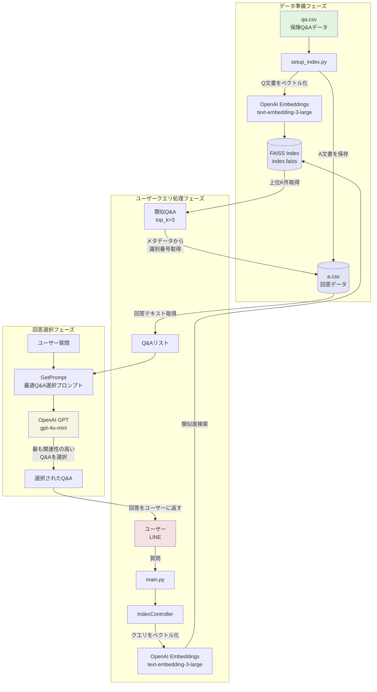

# LangChain & FAISS を使用した保険ドメイン知識の回答処理アーキテクチャ

## 概要
本システムは、LangChainとFAISSを活用して保険に関する質問に対して適切な回答を提供するRAG（Retrieval-Augmented Generation）システムです。

## アーキテクチャ図

## 処理フローの詳細

### 1. データ準備フェーズ（setup_index.py）
- **入力**: qa.csv（質問、回答、内容、URLを含む保険Q&Aデータ）
- **処理**:
  1. 各Q&Aレコードを読み込み
  2. 質問文をOpenAI Embeddings（text-embedding-3-large）でベクトル化
  3. FAISSインデックスに保存（メタデータに識別番号とURLを含む）
  4. 回答文と内容を結合してa.csvに保存

### 2. ユーザークエリ処理フェーズ（IndexController.search_index）
- **入力**: ユーザーからの質問
- **処理**:
  1. 質問をOpenAI Embeddingsでベクトル化
  2. FAISSで類似度検索（L2距離）を実行
  3. 上位K件（デフォルト3件）の類似Q&Aを取得
  4. メタデータの識別番号から対応する回答をa.csvから取得

### 3. 回答選択フェーズ（IndexController.assist_ai）
- **入力**: ユーザー質問と上位K件のQ&Aリスト
- **処理**:
  1. GetPromptで選択用プロンプトを生成
  2. GPT-4o-miniに最も関連性の高いQ&Aを選択させる
  3. 選択されたQ&Aの回答をユーザーに返す

## 主要コンポーネント

- **FAISS**: 高速ベクトル類似検索
- **LangChain**: ベクトルストア管理とドキュメント処理
- **OpenAI Embeddings**: テキストのベクトル化
- **OpenAI GPT**: 最適なQ&A選択の判断
- **Firestore**: ユーザーデータと会話履歴の管理（図では省略）